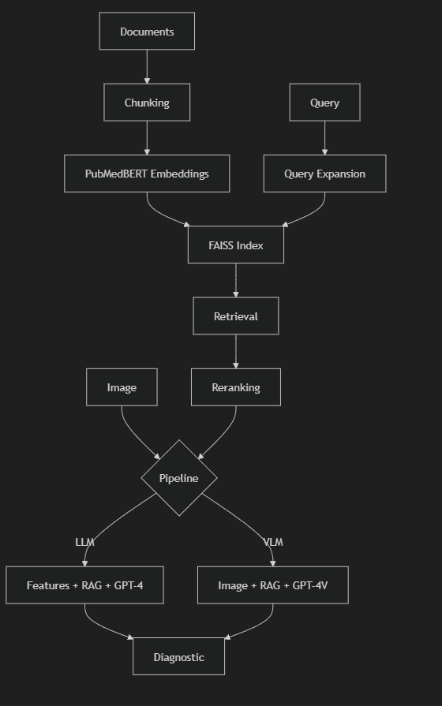

# RAG Pipeline pour Dermatologie Médicale

Pipeline RAG complet pour le diagnostic dermatologique, supportant LLM (avec extraction de features OpenCV) et VLM (analyse d'image directe).

## 📦 Structure du Projet

```
rag_pipeline/
├── config/
│   └── settings.py          # Configuration centralisée
├── embeddings/
│   └── embedding_generator.py # PubMedBERT embeddings
├── vectorstore/
│   └── faiss_store.py        # FAISS vector store
├── retriever/
│   └── rag_retriever.py      # RAG + query expansion
├── reranker/
│   └── cross_encoder.py      # Reranking cross-encoder
├── pipelines/
│   ├── llm_pipeline.py       # Features + RAG + LLM
│   └── vlm_pipeline.py       # Image + RAG + VLM
├── utils/
│   ├── chunking.py           # Document chunking
│   └── logging_config.py     # Logging
├── scripts/
│   └── index_documents.py    # Script d'indexation
├── tests/
│   └── test_pipeline.py      # Tests unitaires
├── examples/
│   └── example_usage.py      # Exemples d'utilisation
└── __init__.py               # Point d'entrée
```

## 🚀 Installation

```bash
# Cloner et installer
cd "Projet RAG MEDICALE"
pip install -r rag_pipeline/requirements.txt
```

## 📝 Usage Rapide

### 1. Indexer des documents médicaux

```bash
python -m rag_pipeline.scripts.index_documents \
    --input ./data/documents \
    --output ./data/index
```

### 2. Diagnostic avec LLM (Features + RAG)

```python
from rag_pipeline import query_llm, init_pipelines

# Initialiser une fois
init_pipelines(index_path="./data/index")

# Diagnostic
result = query_llm("./lesion.jpg", "Est-ce un mélanome?")
print(result.diagnosis)
print(result.differential_diagnoses)
```

### 3. Diagnostic avec VLM (Image directe)

```python
from rag_pipeline import query_vlm

result = query_vlm("./lesion.jpg", "Analyse cette lésion")
print(result.diagnosis)
```

## ⚙️ Configuration

Variables d'environnement requises:
```bash
export OPENAI_API_KEY="your-api-key"
```

## 🧪 Tests

```bash
cd rag_pipeline
python -m pytest tests/ -v
```

## 🔄 Workflow

```
Documents → Chunking → Embeddings → FAISS → Retriever → LLM/VLM → Diagnostic
```

WORKFLOW 
